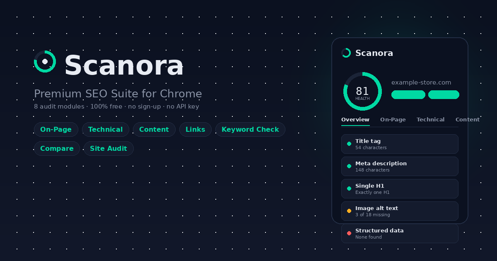

# Scanora — SEO Health Checker

**Scanora** is a premium-grade SEO auditing tool for Google Chrome.
Open it on any web page and, in under a second, get a complete,
professionally organized breakdown of that page's search-engine
health — on-page, technical, content, and link quality — with the
option to export everything as a formal, print-ready PDF report.

It is built for site owners, marketers, freelancers, and developers
who want agency-quality SEO diagnostics without a subscription, a
sign-up form, or an API key.

---

## Contents

- [What Scanora checks](#what-scanora-checks)
- [How to install it](#how-to-install-it)
- [How to use it](#how-to-use-it)
- [Generating a PDF audit report](#generating-a-pdf-audit-report)
- [Privacy](#privacy)
- [Honest limitations](#honest-limitations)
- [For developers](#for-developers)

---

## What Scanora checks

Scanora organizes every audit into eight focused tabs:

| Tab | What it tells you |
|---|---|
| **Overview** | A plain-language checklist of what's healthy and what needs fixing, plus a health-score ring and a trend line across your last 12 scans of that site |
| **On-Page** | A live **Google search-result preview**, title & meta-description length checks, and heading structure (H1–H6) |
| **Technical** | Canonical tag, robots meta, mobile viewport, HTTPS, structured data (JSON-LD), and page load time |
| **Content** | Word count, a **Flesch readability score** on a visual scale, and a top-keyword density table |
| **Keyword** | A **focus-keyword checker** — enter a target phrase and see instantly whether it appears in the title, meta description, an H1, the URL, the first 100 words, and image alt text |
| **Links** | Internal / external / nofollow link counts, Open Graph & Twitter Card tags, and an on-demand **broken-link scanner** |
| **Compare** | Paste a competitor's URL and get a live, side-by-side comparison table — score, title length, word count, links, alt-text coverage, readability |
| **Site Audit** | Checks `/robots.txt` and `/sitemap.xml`, plus an on-demand **bounded 20-page site scan** that follows internal links and reports an average health score across the site |

Every check runs **locally, inside your browser** — nothing is sent
to Scanora or any third party.

---

## How to install it

Scanora is distributed directly from GitHub rather than the Chrome
Web Store, so installation takes two extra clicks compared to a
store listing — everything else works exactly the same.

1. Go to the repository:
   **https://github.com/tanvirjahanshakib/Scanora-SEO-Health-Checker**
2. Click the green **`<> Code`** button → **Download ZIP**.
3. Find the downloaded file (usually in your **Downloads** folder)
   and extract it — right-click → **Extract All** on Windows, or
   double-click on macOS.
4. Open the extracted folder and confirm `manifest.json` is directly
   inside it. If you see another folder inside first, open that one
   — that's the real extension folder.
5. In Chrome, go to `chrome://extensions`.
6. Turn on **Developer mode** (top-right toggle).
7. Click **Load unpacked** and select the folder from step 4.
8. Scanora's icon now appears in your extensions list. Click the
   puzzle-piece icon in Chrome's toolbar, then click the pin next to
   Scanora so it stays visible.

Scanora is now installed. It never expires and never asks for
payment or an account.

**Updating later:** when a new version is released, repeat steps
1–4 with the new download, then go to `chrome://extensions` and
click the refresh icon on Scanora's card.

---

## How to use it

1. Open any normal website (not a `chrome://` page).
2. Click the **Scanora** icon in your toolbar.
3. The page is scanned automatically — no button press needed. A
   health-score ring appears at the top within a second.
4. Move across the tabs (**Overview → Site Audit**) to explore each
   category. If more tabs than fit are visible, scroll sideways
   inside the tab bar with your mouse wheel or trackpad.
5. On the **Keyword** tab, type in the phrase you're targeting and
   click **Check** to see exactly where it does and doesn't appear.
6. On the **Compare** tab, paste a competitor's URL to see both
   pages' key metrics side by side.
7. On the **Site Audit** tab, click **Check robots.txt & sitemap**
   for an instant file check, or **Scan this site** to audit up to
   20 internal pages in one pass.
8. Click the refresh icon in the header at any time to re-scan the
   current page after making changes to it.

---

## Generating a PDF audit report

Click **Generate report** (the banner just below the header) or the
download icon next to it. This opens a new tab containing a formal,
print-ready report — cover page, executive summary, and every check
broken out by category, including any Keyword, Compare, or Site
Audit results from that session.

Inside that tab, click **Download as PDF**. This uses your browser's
built-in print-to-PDF engine, so the result is a real, selectable-text
PDF suitable for sharing with a client or a team — not a screenshot.

---

## Privacy

Scanora requests broad host permissions (`<all_urls>`) because it is
a general-purpose tool meant to work on any site you choose to
inspect — not because it collects data from those sites. Everything
Scanora reads is used only to render results inside the popup or the
report tab, on your device. Nothing is transmitted to Scanora's
developer or to any analytics or advertising service.

The **Compare**, broken-link scanner, and **Site Audit** scan do make
direct network requests from your browser to the URLs you provide or
that the current page links to — this is necessary to analyze those
pages, and it happens only when you explicitly trigger it.

---

## Honest limitations

Scanora deliberately does **not** include backlink graphs, keyword
search-volume data, or competitor rank tracking. That data only
exists inside paid third-party indexes (Ahrefs, Moz, SEMrush,
DataForSEO) — no browser extension can generate it locally, and
faking those numbers would make the tool actively misleading rather
than useful.

A few other things worth knowing:

- The broken-link scanner, Compare tab, and Site Audit scan all make
  live requests from the popup. Sites with aggressive bot-detection
  (Cloudflare challenges, login walls) may return unexpected results.
- Readability and keyword-density scoring use standard English-text
  heuristics.
- The Site Audit scan is capped at 20 pages and runs only while the
  popup stays open — a Manifest V3 platform limitation, not a bug.
  For unlimited crawling of large sites, a dedicated desktop crawler
  (e.g. Screaming Frog) is the right tool for the job.
- The scan does not yet read `Disallow` rules from `robots.txt`
  before following links. It is rate-limited and same-origin only,
  but not yet robots.txt-aware.

---

Built with Manifest V3 · No account, no API key, no tracking

